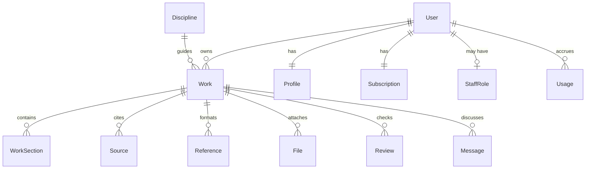

# AssignMe — Architecture (Phase 2)

Source: PRD §§2,4–6,9,13–16. Stack locked in `Docs/ADR-001-stack.md`.
Composer: base model + discipline pack + work-type template + profile + workspace + requirements.

## 1. Data (ERD summary)

Schema: `web/prisma/schema.prisma` (Better Auth tables + app tables, Postgres, no Supabase).

## 2. API (Next.js API / tRPC)

| Area | Endpoints |
|---|---|
| Auth (Better Auth) | signup, login, logout, verify-email, forgot/reset, session |
| Profile | GET/PUT profile, requirements |
| Intelligences | list/get (students), CRUD + version (manager/admin) |
| Work types | GET registry (`web/src/lib/work-types.ts`) |
| Works | CRUD, sections/versions, memory snapshot, delete cascade |
| Research | POST search (query, yearRange, boost NG), GET evidence view, source verify |
| Citations | POST generate/check (style, in-text, reference list) |
| Reviews | POST run (basic free / advanced paid), GET report |
| Files (R2) | POST presign-upload, GET presign-download, DELETE; key `users/{u}/works/{w}/{f}-name` |
| Billing (Paystack) | checkout, webhook, subscription status, trial claim |
| Support | tickets CRUD, scoped reads |

## 3. Evidence pipeline (PRD §6)

query planner (keywords + year range + NG/Africa boost) → Crossref/OpenAlex retrieval → normalize → DOI/URL check → VERIFIED/NEEDS_CHECK → claim-source link → conceptual/theoretical/empirical buckets → evidence view. Never invent authors/studies/DOIs.

## 4. Builder + Reviewer

Builder executes `WORK_TYPE_REGISTRY` steps in order, each step reusing workspace memory; every step editable/regenerable. Reviewer runs structure, evidence, alignment, citation, repetition, missing-section, and compliance checks → severity report + optional apply.

## 5. RBAC matrix

| Capability | Student | Support | Intel Manager | Admin |
|---|---|---|---|---|
| Own profile/works/sources | RW | — | — | R (support grant) |
| Trial/upgrade self | RW | — | — | R |
| Tickets | own | RW assigned | — | RW |
| Discipline packs | R | — | RW | RW |
| Users/plans/payments | — | R billing | — | RW |
| Settings | — | — | — | RW |

AI intelligences are config, never accounts. Support reads of student work require explicit grant + audit.

## 6. Local hosting

Docker Compose: `web` (Next standalone) + `postgres` + `redis` (AI/research queue). Caddy reverse-proxy/TLS in front. Paystack webhooks via signed verification; local testing through tunnel. Backups: pg_dump + R2 metadata export.
